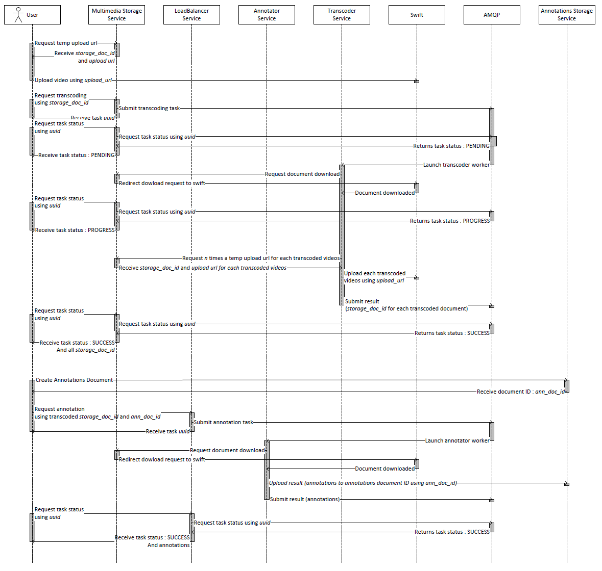

.. _user_guide_overview:

Overview
--------

Workflow
++++++++

A workflow summary can be seen below.

Worker Services Features
++++++++++++++++++++++++

- A worker receives his task directives from the REST Gateway through
  Celery/AMQP
  
  - Can add arbitrary arguments

- Resulting messages are temporarily stored on AMQP
- Optional directive to send resulting annotations directly on :ref:`Annotations
  Storage System <jass:jass_home>`
- Process acquirement, start and stop times are encoded in resulting messages
- Worker process version string is communicated in resulting messages,
  permitting version and results coherence checking
- Ability to keep trace of all processed documents workflow

API specifications
++++++++++++++++++

The API of this service was constructed in a way to respect the requirements of
the :ref:`canarie_api` specification for online services.

Calling Patterns
++++++++++++++++

The services will be invoked using a subset of REST and HTTP methods. In
particular, all services are called using the HTTP GET, POST and PUT methods.

Response Formats
++++++++++++++++

All responses are given using the `JSON <http://www.json.org/>`_ format.
